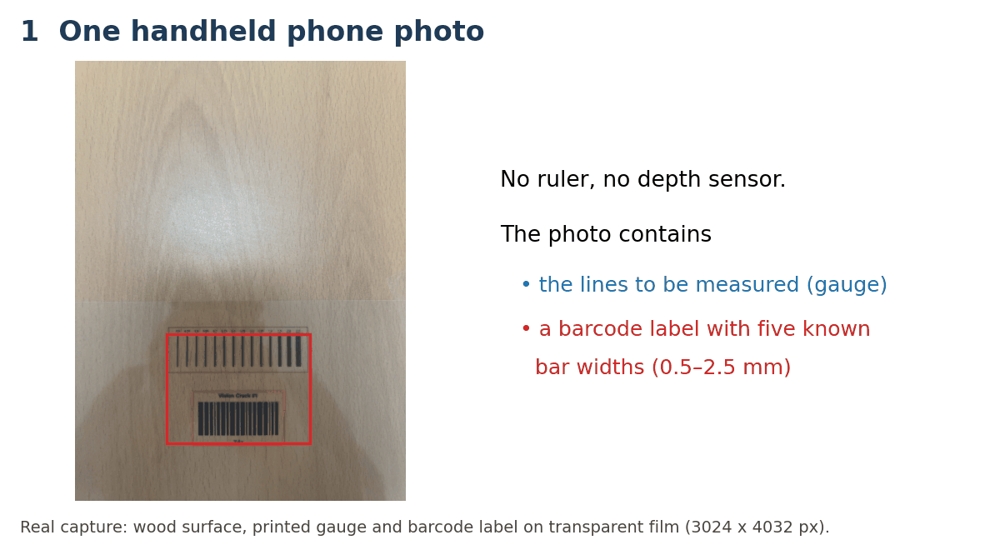
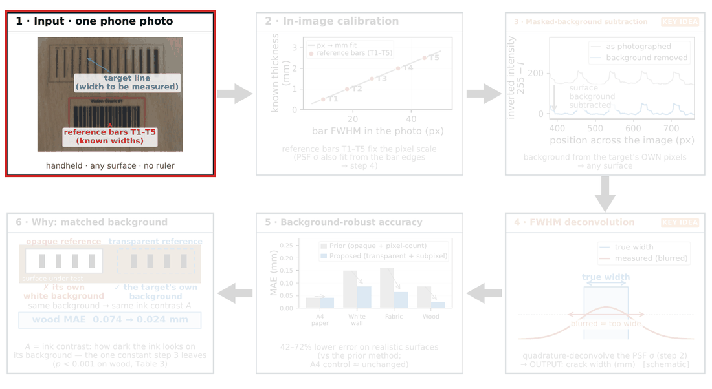

# VisionCrack-3: images, code and results

Data and code for the manuscript

> **Subpixel Crack-Width Measurement on Textured Surfaces with a Transparent Barcode Reference: A Controlled Smartphone Study**
> Hojune Ann, Yong-Rae Yu, Yongsoo Kim, Jong-Jae Lee (manuscript under review).



Schematic of the pipeline (Figure 1 of the paper, step by step):



## Quick start (eight sample images in this repository)

The eight folders `1_opaque_W/` to `8_transparent_WO/` each hold one original, unmodified capture from that condition. Install the packages and measure any of them, for example the wood capture with the transparent reference:

```
pip install numpy scipy opencv-python matplotlib
python vc_measure_rev6.py 8_transparent_WO/WO1.png --bc-roi 1104,3114,770,332 --bc-y 166 --cr-roi 903,2564,1189,141 --cr-y 70 --keystone --save result.png
```

The console lists the 14 measured widths against the nominal gauge widths, and `result.png` shows the diagnostic figure. The arguments for all eight samples are below; each reproduces the per-capture MAE in the published data. Without the ROI arguments, the program opens a window in which the barcode and gauge regions are drawn by hand, as in the original runs. All 80 original captures are in the release archives listed under Files.

| Sample | Condition | ROI arguments | MAE (mm) |
|---|---|---|---|
| `1_opaque_W/1784091624.png` | A4 paper, opaque | `--bc-roi 1148,3117,770,323 --bc-y 161 --cr-roi 919,2560,1198,157 --cr-y 78 --keystone` | 0.0187 |
| `2_opaque_WW/1784092680.png` | white wall, opaque | `--bc-roi 1143,3165,745,484 --bc-y 73 --cr-roi 911,2576,1214,165 --cr-y 81 --keystone` | 0.1322 |
| `3_opaque_FA/1784092076.png` | fabric, opaque | `--bc-roi 1112,3113,780,346 --bc-y 173 --cr-roi 883,2564,1246,185 --cr-y 92 --keystone` | 0.0794 |
| `4_opaque_WO/1784092257.png` | wood, opaque | `--bc-roi 1136,3117,760,326 --bc-y 163 --cr-roi 915,2576,1202,210 --cr-y 105 --keystone` | 0.0479 |
| `5_transparent_W/W1.png` | A4 paper, transparent | `--bc-roi 1124,3118,770,329 --bc-y 164 --cr-roi 915,2572,1185,153 --cr-y 76 --keystone` | 0.0325 |
| `6_transparent_WW/WW1.png` | white wall, transparent | `--bc-roi 1132,3118,780,329 --bc-y 164 --cr-roi 891,2556,1250,190 --cr-y 95 --keystone` | 0.0430 |
| `7_transparent_FA/FA1.png` | fabric, transparent | `--bc-roi 1084,3211,780,268 --bc-y 41 --cr-roi 915,2564,1177,185 --cr-y 92 --keystone` | 0.0507 |
| `8_transparent_WO/WO1.png` | wood, transparent | `--bc-roi 1104,3114,770,332 --bc-y 166 --cr-roi 903,2564,1189,141 --cr-y 70 --keystone` | 0.0421 |

## Files

The code, the run log and the analysis files are in this repository. The eight image archives are attached to the GitHub release (v1.0) because each exceeds the 100 MB file limit of a repository.

| File | Contents |
|---|---|
| `README.md` | this file (repository) |
| `1_opaque_W/` to `8_transparent_WO/` | one original capture per condition for a quick test (repository) |
| `vc_measure_rev6.py` | measurement code (Phase 3 of the paper; repository) |
| `results_summary.csv` | run log of the measurement code (all runs, see note below; repository) |
| release: `1_opaque_W_VisionCrack3.zip` | opaque reference, A4 paper |
| release: `2_opaque_WW_VisionCrack3.zip` | opaque reference, white (painted) wall |
| release: `3_opaque_FA_VisionCrack3.zip` | opaque reference, fabric |
| release: `4_opaque_WO_VisionCrack3.zip` | opaque reference, wood |
| release: `5_transparent_W_VisionCrack3.zip` | transparent reference, A4 paper |
| release: `6_transparent_WW_VisionCrack3.zip` | transparent reference, white (painted) wall |
| release: `7_transparent_FA_VisionCrack3.zip` | transparent reference, fabric |
| release: `8_transparent_WO_VisionCrack3.zip` | transparent reference, wood |
| `analysis/` | analysis scripts and their outputs (repository) |

Each condition archive contains one folder with

```
*.png                     10 handheld captures (3024 x 4032 px)
results/                  outputs of vc_measure_rev6.py for these captures
  results_perwidth_*.csv  estimated width per capture and gauge line (tag, truth_mm, est_mm, err_mm)
  results_profiles_*.csv  intensity profiles of the gauge region per capture
  results_*.xlsx          per-capture summary (px/mm, PSF sigma, MAE, ...)
  vc_result_*.png         diagnostic figure per capture
```

`analysis/` contains

```
analysis/
  vc6.py                      identical copy of vc_measure_rev6.py (imported by the scripts)
  vcmod.py                    copy of measure_v2() with switches for the ablation
  capture_level_stats.py      capture-level statistics (Table 3, substrate test)
  ablation.py                 ablation and parameter sensitivity (Table 4), sigma / k_q exchange tests
  summarize.py                summary of the ablation output
  wood_cause.py               target-side analysis of the opaque vs transparent difference (Experiment 3)
  recover.py, recover2.py, find_cr.py, find_cr2.py, refpart.py, runone.py
                              recovery of the regions of interest (see below)
  results/                    outputs of the scripts above (roi_*.json, abl_*.csv, swap_*.csv, wood_cause_*.csv, ...)
```

To run the scripts, unzip the eight condition archives into a folder `images/`, put `results_summary.csv` into `images/`, and keep `analysis/` next to `images/`.

## Ground truth

The target is a printed crack-width gauge on transparent film. The ground truth is the nominal (design) width of the 14 evaluated lines: 0.50, 0.55, 0.60, 0.65, 0.70, 0.75, 0.80, 0.85, 0.90, 0.95, 1.00, 1.50, 2.00 and 2.50 mm. The printed widths were not measured independently.

## Reproducing a measurement

Requirements used: Python 3, numpy 2.4.4, scipy 1.17.1, opencv-python 4.13.0, pandas 3.0.2, statsmodels 0.15.0.

The regions of interest (barcode `BC`, gauge `CR`, and their scan lines) were drawn by hand in the original runs and were not stored. They were recovered from the exported profiles and the logged reference constants and are given in `analysis/results/roi_<condition>.json` (`maxdiff` is the largest difference, in mm, between the recomputed and the published per-width estimates; 0.0 means exact reproduction). One capture can be measured with

```
python vc_measure_rev6.py images/1_opaque_W_VisionCrack3/1784091624.png \
  --bc-roi x,y,w,h --bc-y BCY --cr-roi x,y,w,h --cr-y CRY --keystone
```

using the values of that capture from the JSON file (`BC`, `BCY`, `CR`, `CRY`).

## Reproducing the analyses

Run from the `analysis/` folder; the scripts read the data from `../images/` (or from the folder given in the environment variable `VC3_DATA`).

```
python capture_level_stats.py                     # Table 3 statistics
python ablation.py 8_transparent_WO_VisionCrack3  # Table 4 for one condition -> abl_<condition>.csv
python summarize.py                               # summary of all abl_*.csv in the current folder
python wood_cause.py                              # Experiment 3, tests of the cause -> wood_cause_*.csv
```

## Note on the run log

`results_summary.csv` lists every run of the measurement code. The transparent-fabric captures (FA1-FA10) were measured twice with re-drawn regions of interest; the results reported in the paper are those of the later run (the results in `7_transparent_FA_VisionCrack3/results/`).

## License

- Code (`*.py`): MIT License, see [`LICENSE`](LICENSE).
- Data (images, release archives, run log, analysis outputs, GIFs): CC BY 4.0, see [`LICENSE-DATA`](LICENSE-DATA).

If you use the data or code, please cite the paper (reference will be added after publication).
